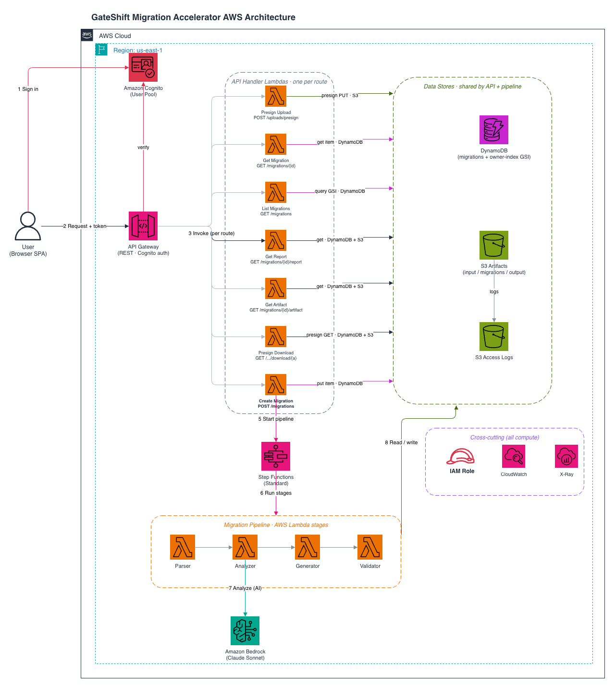

# GateShift — API Gateway Migration Accelerator

GateShift is an AI-powered tool that migrates **Kong Gateway** configurations to **Amazon API Gateway**. Upload a Kong declarative YAML, and GateShift parses it, uses **Amazon Bedrock** (Claude Sonnet) to map each Kong feature to its AWS equivalent, generates a deployable **AWS SAM** template (plus a Lambda authorizer and a human-readable report), and scores the migration with a confidence rating and gap analysis — all through a React web UI.

- **Input:** Kong declarative config (`kong.yaml`, DB-less format)
- **Output:** SAM template, OpenAPI-style resources, optional Lambda authorizer code, validation report, and a confidence score
- **Backbone:** Serverless (API Gateway + Lambda + Step Functions + Bedrock + DynamoDB + S3)

> **Disclaimer:** This project is sample/educational code and is not intended for production use without additional security hardening and review. See [SECURITY.md](SECURITY.md) for production hardening recommendations.

---

## Architecture




### Request flow (numbered in the diagram)

1. **Sign in** — the browser authenticates against **Amazon Cognito** (User Pool) and receives an ID token.
2. **Request + token** — the browser calls the **API Gateway** REST API over HTTPS, sending the Cognito ID token in the `Authorization` header. A Cognito authorizer validates it on every route (invalid → `401`).
3. **Invoke (per route)** — API Gateway routes each request to its dedicated **API Handler Lambda** (7 functions, one per endpoint).
4. **Query data** — each handler touches only what it needs:
   - *Presign Upload* → `s3:PutObject` presigned URL (S3 `input/`)
   - *Create Migration* → `PutItem` (DynamoDB) **and** `StartExecution` (Step Functions)
   - *List Migrations* → `Query` the `owner-index` GSI (DynamoDB)
   - *Get Migration* → `GetItem` (DynamoDB)
   - *Get Report / Get Artifact / Presign Download* → `GetItem` (DynamoDB) + `GetObject` / presign (S3)
5. **Start pipeline** — Create Migration kicks off the **Step Functions** Standard workflow.
6. **Run stages** — Step Functions runs the pipeline: **Parser → Analyzer → Generator → Validator**.
7. **Analyze (AI)** — the Analyzer calls **Amazon Bedrock** (`InvokeModel`, Claude Sonnet) for feature mapping and gap detection.
8. **Read / write** — pipeline stages read and write intermediate + output artifacts in **S3** and update state/results in **DynamoDB**.

The browser then polls *Get Migration* until the status is terminal (`COMPLETE`, `NEEDS_REVIEW`, or `FAILED`) and reads results via *Get Report* / *Get Artifact*.

---

## How the components work

| Component | Service | Responsibility |
|---|---|---|
| **Web UI** | React + TypeScript + Vite | Upload config, poll status, preview/download artifacts. Runs locally; authenticates directly with Cognito. |
| **Amazon Cognito** | User Pool + App Client | Authentication. Admin-create-only (no open sign-up); optional MFA; strong password policy. |
| **API Gateway** | REST API (stage `dev`) | Public entry point. Cognito authorizer on every route, request throttling, access logs, X-Ray tracing. |
| **API Handler Lambdas** | AWS Lambda (Python 3.12) × 7 | One function per endpoint; each enforces caller ownership and least-privilege data access. |
| **Step Functions** | Standard workflow | Orchestrates the four-stage migration pipeline with retries and failure handling. |
| **Parser** | Lambda | Converts Kong YAML into a normalized intermediate representation (IR). |
| **Analyzer** | Lambda + Bedrock | Deterministic Kong→AWS mapping, then Bedrock for edge cases, REST-vs-HTTP recommendation, and gaps. |
| **Generator** | Lambda | Produces the SAM template, optional Lambda authorizer code, and a Markdown report. |
| **Validator** | Lambda | Computes route/auth/plugin coverage, a confidence score, and a gap list. |
| **Amazon Bedrock** | Claude Sonnet (inference profile) | The reasoning engine for feature analysis. |
| **DynamoDB** | `migrations` table + `owner-index` GSI | Migration state, ownership, and results. SSE + point-in-time recovery. |
| **S3 Artifacts** | Bucket (`input/`, `migrations/`, `output/`) | Uploaded configs and generated artifacts. SSE, versioning, TLS-only, public access blocked. |
| **CloudWatch / X-Ray** | Observability | API access logs, Lambda logs, Step Functions execution logs, distributed tracing. |

There is **no VPC** — the stack is fully serverless and uses AWS-managed regional endpoints over HTTPS.

---

## Prerequisites

- **AWS SAM CLI** and **AWS CLI v2** (configured with credentials for your account)
- **Node.js 18+** (frontend)
- **Python 3.12** (backend Lambda runtime and tests)
- **Amazon Bedrock model access** enabled for Claude Sonnet in your region (default `us-east-1`). The default model is the cross-region inference profile `us.anthropic.claude-sonnet-4-20250514-v1:0`.

---

## Project structure

```
gateshift-migration-accelerator/
├── backend/                          # AWS SAM backend
│   ├── template.yaml                 # All AWS resources (API GW, Lambdas, SFN, DynamoDB, S3, Cognito, IAM)
│   ├── statemachine/
│   │   └── pipeline.asl.json         # Step Functions definition
│   ├── src/
│   │   ├── pipeline_common.py        # Shared status / mark-failed helpers for pipeline stages
│   │   ├── api/                      # REST API handlers (one per route)
│   │   │   ├── helpers.py            # Auth (Cognito claims), ownership checks, CORS
│   │   │   ├── presign_upload.py
│   │   │   ├── create_migration.py
│   │   │   ├── list_migrations.py
│   │   │   ├── get_migration.py
│   │   │   ├── get_report.py
│   │   │   ├── get_artifact.py
│   │   │   └── presign_download.py
│   │   ├── parser/                   # Kong YAML → normalized IR
│   │   │   ├── handler.py
│   │   │   ├── kong_parser.py
│   │   │   └── models.py             # Pydantic IR models
│   │   ├── analyzer/                 # Bedrock analysis + feature mapping
│   │   │   ├── handler.py
│   │   │   ├── feature_map.py
│   │   │   └── prompts.py
│   │   ├── generator/handler.py      # SAM template + authorizer + report generation
│   │   └── validator/handler.py      # Coverage, confidence score, gap report
│   ├── sample-configs/kong/          # Sample Kong configs (basic / medium / complex)
│   ├── tests/                        # pytest suite (unit + fixtures)
│   ├── pytest.ini
│   └── requirements-dev.txt
│
├── frontend/                         # React + TypeScript + Vite
│   ├── src/
│   │   ├── api/                      # API client, auth (Cognito), config
│   │   ├── components/               # Upload, analysis, output, layout, common
│   │   ├── hooks/                    # TanStack Query hooks (polling)
│   │   ├── pages/                    # Dashboard, Migrate, Migration detail, Login
│   │   ├── store/                    # Zustand stores (auth, app)
│   │   ├── types/ · utils/ · styles/
│   ├── mock-server.cjs               # Local mock API for auth-free UI development
│   ├── .env                          # Frontend config (gitignored in real use)
│   └── package.json · vite.config.ts · tailwind.config.cjs
│
├── docs/
│   ├── architecture.drawio           # Architecture diagram (source)
│   ├── architecture-summary.md       # Written architecture reference
│   └── openapi.yaml                  # OpenAPI 3.0 API specification
│
├── README.md
├── SECURITY.md
├── CODE_OF_CONDUCT.md
├── CONTRIBUTING.md
└── .gitignore
```

---

## Deploy

### Step 1 — Enable Bedrock model access (one-time)

In the AWS console → **Bedrock → Model access**, enable the Claude Sonnet model in the region you will deploy to (default `us-east-1`).

### Step 2 — Build and deploy the backend

```bash
cd backend
sam build

# First time — interactive. Set AllowedOrigin to your frontend origin.
sam deploy --guided \
  --stack-name gateshift \
  --capabilities CAPABILITY_IAM \
  --region us-east-1 \
  --parameter-overrides AllowedOrigin=http://localhost:3000

# Subsequent deploys
sam deploy
```

Note the stack **Outputs**: `ApiUrl`, `UserPoolId`, `UserPoolClientId`, `Region`.

### Step 3 — Create a user

Self-service sign-up is disabled (`AllowAdminCreateUserOnly: true`), so an administrator creates the account. This prevents anyone who finds the app client ID from consuming your Bedrock capacity.

```bash
POOL_ID=<UserPoolId output>

aws cognito-idp admin-create-user \
  --user-pool-id "$POOL_ID" \
  --username you@example.com \
  --user-attributes Name=email,Value=you@example.com Name=email_verified,Value=true \
  --message-action SUPPRESS \
  --region us-east-1

# Optional: set a permanent password (else the UI handles the first-login change)
aws cognito-idp admin-set-user-password \
  --user-pool-id "$POOL_ID" \
  --username you@example.com \
  --password '<StrongPassword>' \
  --permanent \
  --region us-east-1
```

Passwords must meet the pool policy: **12+ characters with uppercase, lowercase, number, and symbol**. If you skip `admin-set-user-password`, the sign-in screen prompts you to set a new password on first login (that flow is supported).

### Step 4 — Configure and run the frontend

Edit `frontend/.env` with the stack outputs:

```env
VITE_API_BASE_URL=https://<api-id>.execute-api.us-east-1.amazonaws.com/dev
VITE_AWS_REGION=us-east-1
VITE_COGNITO_USER_POOL_ID=<UserPoolId output>
VITE_COGNITO_CLIENT_ID=<UserPoolClientId output>
```

Then:

```bash
cd frontend
npm install
npm run dev
```

Open **http://localhost:3000**, sign in, and run a migration using a config from `backend/sample-configs/kong/` (start with `medium-api.yaml`).

> **Local UI-only mode:** if `VITE_COGNITO_CLIENT_ID` is empty or set to `local-dev`, the app runs against the bundled mock API (`node mock-server.cjs`) with no authentication — handy for frontend work without deploying.

---

## API

The full contract is documented in [`docs/openapi.yaml`](docs/openapi.yaml) (OpenAPI 3.0). Every route requires a Cognito ID token in the `Authorization` header.

| Method | Path | Purpose |
|---|---|---|
| POST | `/uploads/presign` | Get a presigned S3 URL to upload a Kong config |
| POST | `/migrations` | Create a migration and start the pipeline |
| GET | `/migrations` | List the caller's migrations |
| GET | `/migrations/{id}` | Get a migration's status and summary |
| GET | `/migrations/{id}/report` | Get the full validation report |
| GET | `/migrations/{id}/artifact/{artifact}` | Get an artifact's text content (preview/download) |
| GET | `/migrations/{id}/download/{artifact}` | Get a presigned S3 download URL (legacy) |

---

## Confidence score

After generating the SAM template, the validator stage computes a **confidence score** (0–100) that estimates how completely the source Kong configuration was mapped to Amazon API Gateway. It is a weighted average of three coverage checks plus a config-accuracy baseline:

| Component | Weight | What it measures |
|-----------|--------|------------------|
| Route coverage | 30% | Share of source routes (`METHOD path`) that appear as resources in the migration plan. If the plan has no explicit resources but routes exist, it is credited at 80% (partial credit). |
| Auth coverage | 25% | Share of source **authentication** plugins mapped to an API Gateway authorizer (via a `direct` or `lambda` mapping). If there are no auth plugins, this scores 100%. |
| Plugin coverage | 25% | Share of all plugins (per-API + global) that were mapped to something other than a `gap`. If there are no plugins, this scores 100%. |
| Config accuracy baseline | 20% | A fixed baseline credit. A full check would compare mapped configuration values field-by-field; that deeper comparison is not yet implemented, so this component currently contributes its full weight. |

The score is calculated as:

```
confidence = route_coverage%   × 0.30
           + auth_coverage%    × 0.25
           + plugin_coverage%  × 0.25
           + 100               × 0.20   # config accuracy baseline
```

**Status thresholds**

- **`COMPLETE`** — score **≥ 80**. The migration mapped cleanly; review the flagged gaps (if any) and deploy.
- **`NEEDS_REVIEW`** — score **< 80**. Some routes, auth, or plugins could not be confidently mapped; inspect the gap analysis before deploying.

> The score is a mapping-completeness signal, not a correctness guarantee. Because the generated artifacts come from an AI model acting on your uploaded config, always human-review the SAM template, Lambda authorizer, and gap report before deploying. The per-migration validation report (`output/validation-report.json`) breaks down each coverage number and lists the specific unmapped items.

---

## Development

### Run the backend tests

```bash
cd backend
python3 -m pytest tests/ -q
```

### Type-check and build the frontend

```bash
cd frontend
npx tsc -p tsconfig.app.json --noEmit
npm run build
```

### Validate the SAM template

```bash
cd backend
sam validate --lint
```

---

## Configuration

### Backend parameters (SAM)

| Parameter | Description | Default |
|---|---|---|
| `BedrockModelId` | Bedrock model / inference profile ID | `us.anthropic.claude-sonnet-4-20250514-v1:0` |
| `BedrockRegion` | Region hosting the Bedrock model | `us-east-1` |
| `AllowedOrigin` | Exact browser origin allowed for CORS and S3 uploads (no wildcard) | `http://localhost:3000` |
| `LogRetentionDays` | CloudWatch log retention | `30` |

### Frontend (`.env`)

| Variable | Description |
|---|---|
| `VITE_API_BASE_URL` | Deployed API Gateway base URL |
| `VITE_AWS_REGION` | Region for Cognito |
| `VITE_COGNITO_USER_POOL_ID` | Cognito User Pool ID |
| `VITE_COGNITO_CLIENT_ID` | Cognito App Client ID (empty or `local-dev` → mock mode) |

---

## Troubleshooting

- **Sign-in does nothing / new-password prompt loops** — the user is in `FORCE_CHANGE_PASSWORD`. Either set a permanent password (`admin-set-user-password --permanent`) or complete the prompt in the UI.
- **Sign-up fails / "not allowed"** — expected; self-service sign-up is disabled. Create users with `admin-create-user`.
- **CORS errors in the browser** — the `AllowedOrigin` parameter must match your frontend URL exactly.
- **Analyzer stage fails at runtime** — almost always Bedrock model access / model ID. Confirm the model is enabled in `BedrockRegion` and the ID is a valid on-demand or inference-profile ID.
- **Migration shows `FAILED`** — open the migration; the record carries a short error. Full detail is in the Step Functions execution and CloudWatch logs.
- **Migration seems stuck** — the UI stops polling after 10 minutes and flags a stall; check the Step Functions execution in the console.

---

## Cleanup

```bash
sam delete --stack-name gateshift --region us-east-1
```

The S3 buckets and DynamoDB table use `DeletionPolicy: Retain`, so `sam delete` leaves them behind on purpose. Empty and remove them manually if you want a full teardown.

---

## Security

See [SECURITY.md](SECURITY.md) for the full posture (authentication, authorization, encryption, IAM least-privilege, data lifecycle, and monitoring). To report a vulnerability, follow [CONTRIBUTING.md](CONTRIBUTING.md#security-issue-notifications) — please do not open a public issue.

## Contributing

Contributions are welcome. Please read [CONTRIBUTING.md](CONTRIBUTING.md) and our [Code of Conduct](CODE_OF_CONDUCT.md).

## License

This project is licensed under the MIT-0 License. See the [LICENSE](LICENSE) file.

## Authors

- Rohit Saha
- Arthi Jaganathan
